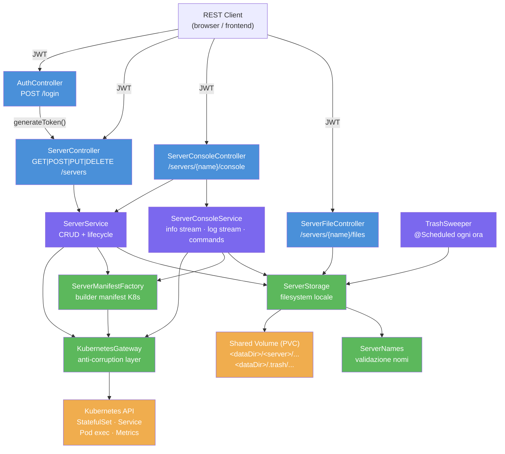
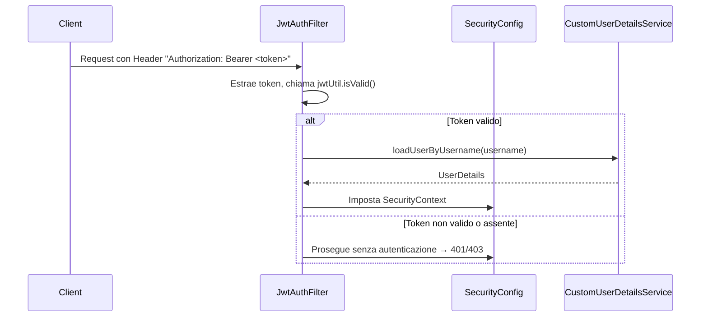
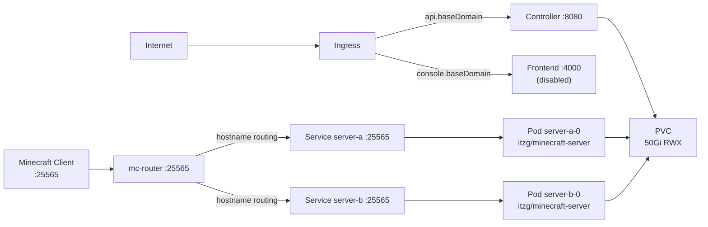

# Architettura

## Panoramica

Minecraft Controller è un'API REST Spring Boot che gestisce server Minecraft come **StatefulSet Kubernetes**. Non usa database: la configurazione di ogni server è serializzata come JSON in un'annotation dello StatefulSet. I file di gioco risiedono su un unico **PersistentVolumeClaim** condiviso (ReadWriteMany), con una sotto-cartella per server.

Ogni server Minecraft è una coppia di risorse Kubernetes:
- **StatefulSet** — controlla il ciclo di vita del pod (`itzg/minecraft-server`)
- **Service** — espone la porta 25565; l'annotation `mc-router.itzg.me/externalServerName` è usata da `itzg/mc-router` per instradare le connessioni Minecraft via hostname

## Diagramma dei Componenti



## Controller REST

| Controller | Base Path | Tag OpenAPI | Responsabilità |
|---|---|---|---|
| `AuthController` | `/login` | AUTH | Autenticazione, emissione JWT |
| `ServerController` | `/servers` | SERVER | CRUD server + start/stop/terminate |
| `ServerConsoleController` | `/servers/{name}/console` | CONSOLE | Info SSE, log SSE, invio comandi |
| `ServerFileController` | `/servers/{name}/files` | FILE SYSTEM | Gestione file sul volume condiviso |

## Layer di Servizio

### `ServerService`
Facade per il ciclo di vita dei server. Coordina `KubernetesGateway`, `ServerManifestFactory` e `ServerStorage`. Esegue la validazione di business (range CPU/memory, tipo server, API key CurseForge).

### `ServerConsoleService`
Gestisce il piano live/streaming. Mantiene una cache `ConcurrentHashMap` di stream SSE condivisi per server (uno stream per nome, condiviso tra tutti i subscriber). La cache usa `.replay(1).refCount(1, 10s)`: il flux rimane vivo 10 secondi dopo l'ultimo subscriber, poi viene rimosso.

### `KubernetesGateway`
**Unica classe che comunica con l'API Kubernetes**. Tutte le `ApiException` sono tradotte in eccezioni applicative tipizzate:

| Codice HTTP K8s | Eccezione applicativa |
|---|---|
| 404 | `ResourceNotFoundException` |
| 409 | `ResourceAlreadyExistsException` |
| 400, 422 | `InvalidRequestException` |
| altro | `ServerException` |

### `ServerManifestFactory`
Costruisce gli oggetti Kubernetes (nessuna chiamata al cluster). Legge/scrive la configurazione serializzata come JSON nell'annotation `it.lorisdemicheli/config`.

### `ServerStorage`
Tutti gli accessi al volume condiviso. Ogni metodo pubblico riceve `(String server, String relPath)` e valida che il path non evada la cartella del server (controllo anti-traversal `..` e symlink).

Layout volume:
```
<dataDir>/
├── <server-a>/          ← montato nel pod come subPath=server-a
│   ├── logs/
│   │   └── latest.log
│   └── ...
├── <server-b>/
└── .trash/
    └── <server-a>-<millis>/  ← soft-delete, purged da TrashSweeper
```

### `TrashSweeper`
Componente schedulato (`@Scheduled`): si avvia 60 secondi dopo il boot, poi ogni ora. Purga permanentemente le cartelle in `.trash` il cui timestamp supera la retention configurata (default 24h).

## Sicurezza



- Sessioni: `STATELESS` (no HttpSession)
- Password admin: BCrypt-encoded a startup da `CustomUserDetailsService`
- Path pubblici: `/login`, `/swagger-ui/**`, `/v3/api-docs/**`
- `JwtAuthFilter.shouldNotFilterAsyncDispatch()` restituisce `false` → il filtro viene eseguito anche per i dispatch asincroni (necessario per SSE)

## Moduli Maven e Dipendenze Chiave

Il progetto ha un solo modulo Maven: `backend/`.

```xml
<!-- Dipendenze principali -->
io.kubernetes:client-java-spring-integration:24.0.0
org.springframework.boot:spring-boot-starter-web
org.springframework.boot:spring-boot-starter-security
io.projectreactor:reactor-core          <!-- solo per SSE -->
io.jsonwebtoken:jjwt-api:0.11.5
org.springdoc:springdoc-openapi-starter-webmvc-ui:3.0.0
org.projectlombok:lombok
```

> **Nota di build**: Lombok deve essere elencato in `<annotationProcessorPaths>` del `maven-compiler-plugin`. Se presente solo in `<dependencies>`, il processor viene escluso quando `<annotationProcessorPaths>` è configurato esplicitamente.

## Configurazione Runtime

Tutti i parametri sono in `backend/src/main/resources/application.properties`.

| Proprietà | Default | Obbligatorio |
|---|---|---|
| `it.lorisdemicheli.minecraft-servers.namespace` | `minecraft-servers` | no |
| `it.lorisdemicheli.minecraft-servers.base-domain` | — | no (senza routing mc-router) |
| `it.lorisdemicheli.minecraft-servers.server-image` | `itzg/minecraft-server` | no |
| `it.lorisdemicheli.minecraft-servers.termination-grace-period-seconds` | `120` | no |
| `it.lorisdemicheli.minecraft-servers.cors-allowed-origins` | `http://localhost:4200` | no |
| `it.lorisdemicheli.minecraft-servers.curse-forge-api-key` | — | solo per CURSEFORGE |
| `it.lorisdemicheli.minecraft-servers.storage.data-dir` | `./data` | no |
| `it.lorisdemicheli.minecraft-servers.storage.claim-name` | `minecraft-servers-data` | no |
| `it.lorisdemicheli.minecraft-servers.storage.trash-retention-hours` | `24` | no |
| `it.lorisdemicheli.minecraft-servers.storage.min-free-gb` | `2` | no |
| `it.lorisdemicheli.minecraft-servers.storage.uid` | `1000` | no |
| `it.lorisdemicheli.minecraft-servers.storage.gid` | `1000` | no |
| `it.lorisdemicheli.minecraft-servers.security.username` | `admin` | no |
| `it.lorisdemicheli.minecraft-servers.security.password` | — | **sì** |
| `it.lorisdemicheli.minecraft-servers.security.jwt-secret` | — | **sì** (min 32 char) |
| `it.lorisdemicheli.minecraft-servers.security.jwt-expiration-ms` | `86400000` (24h) | no |
| `kubernetes.client.file` | — | no (usa in-cluster se assente) |

## Infrastruttura Kubernetes (Helm)

Il chart `charts/minecraft-controller/` crea:
- `Deployment` per il controller (Spring Boot, porta 8080)
- `Deployment` per mc-router (`itzg/mc-router`, porta 25565)
- `Deployment` per il frontend Angular (disabilitato di default)
- `PersistentVolumeClaim` condiviso (default: Longhorn RWX, 50Gi)
- `Secret` con credenziali (generato o da `existingSecret`)
- `Ingress` per API (`api.<baseDomain>`) e console (`console.<baseDomain>`)
- `RBAC` (Role, RoleBinding per controller e router)


