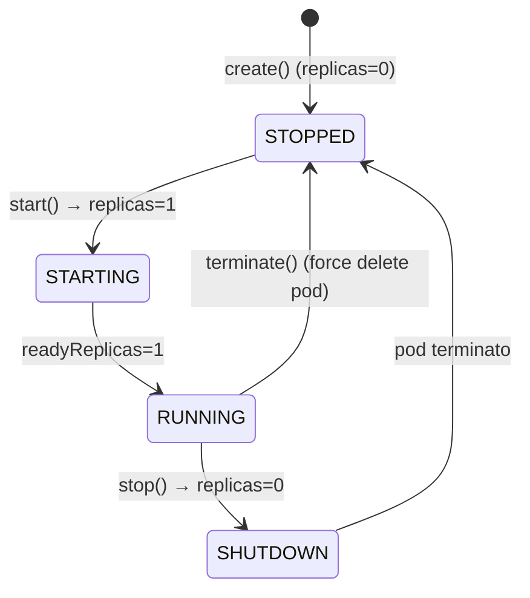
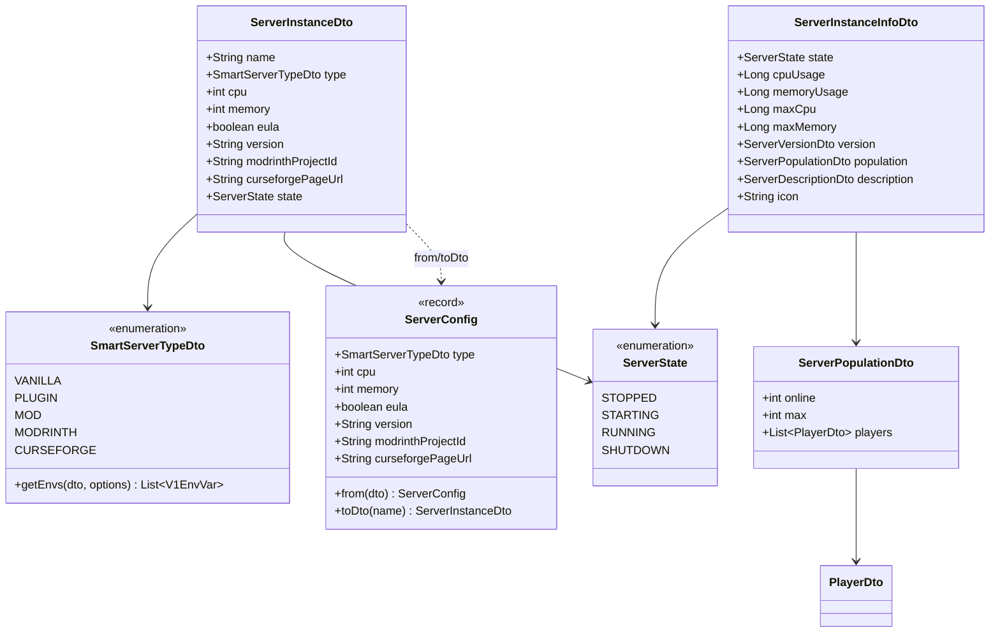

# Domain Model

## Glossario

| Termine | Definizione |
|---|---|
| **Server** | Un'istanza di server Minecraft gestita dal controller, identificata da un nome univoco. |
| **ServerState** | Stato derivato del server, calcolato dalle informazioni del StatefulSet Kubernetes. |
| **ServerConfig** | Configurazione immutabile (dal punto di vista del K8s) di un server: tipo, risorse, parametri. Persiste come JSON nell'annotation del StatefulSet. |
| **Namespace** | Namespace Kubernetes dove vivono le risorse dei server (default: `minecraft-servers`). |
| **Volume condiviso** | PersistentVolumeClaim unico montato da tutti i pod server (subPath per server) e dal controller. |
| **Trash** | Cartella `.trash/` del volume dove vengono spostati i dati dei server eliminati (soft-delete). |

---

## Entità Principali

### `ServerInstanceDto`

DTO principale usato per creare, leggere e aggiornare un server.

| Campo | Tipo | Default | Validazione / Note |
|---|---|---|---|
| `name` | `String` | — | DNS-1035: `[a-z][a-z0-9-]{0,38}[a-z0-9]?`, max 40 char. Riservati: `console`, `api`. Immutabile dopo la creazione. |
| `type` | `SmartServerTypeDto` | — | **Obbligatorio**. Determina il `TYPE` env var e i parametri specifici. |
| `cpu` | `int` | `1000` | Milli-CPU. Vincolo: `[100, 64000]`. |
| `memory` | `int` | `1024` | Megabyte. Vincolo: `[512, 262144]`. |
| `eula` | `boolean` | `false` | Minecraft EULA acceptance. |
| `version` | `String` | — | Versione Minecraft (usata da VANILLA, PLUGIN, MOD). |
| `modrinthProjectId` | `String` | — | **Obbligatorio** se `type = MODRINTH`. |
| `curseforgePageUrl` | `String` | — | **Obbligatorio** se `type = CURSEFORGE`. Richiede anche `curseForgeApiKey` configurata. |
| `state` | `ServerState` | — | **Read-only** (ignorato su create/update, popolato dal server). |

### `ServerConfig` (record)

Sottoinsieme di `ServerInstanceDto` persistito nell'annotation K8s. Esclude `name` e `state` (derivabili da K8s).

```java
record ServerConfig(SmartServerTypeDto type, int cpu, int memory, boolean eula,
    String version, String modrinthProjectId, String curseforgePageUrl)
```

Conversioni: `ServerConfig.from(dto)` → annotation JSON; `config.toDto(name)` → DTO con state = null.

### `ServerInstanceInfoDto`

Snapshot live di un server in esecuzione (risposta di `/console/info`).

| Campo | Tipo | Descrizione |
|---|---|---|
| `state` | `ServerState` | Stato corrente (costruttore required). |
| `cpuUsage` | `Long` | Milli-CPU usati (da Kubernetes Metrics API). |
| `memoryUsage` | `Long` | MB usati (da Kubernetes Metrics API). |
| `maxCpu` | `Long` | Limite CPU configurato in milli-CPU. |
| `maxMemory` | `Long` | Limite memoria configurato in MB. |
| `version` | `ServerVersionDto` | Versione server (da `mc-monitor status`). |
| `population` | `ServerPopulationDto` | Online/max/lista giocatori. |
| `description` | `ServerDescriptionDto` | MOTD del server. |
| `icon` | `String` | Favicon base64 del server. |

---

## Enumerazioni

### `ServerState`

Deriva dallo stato del StatefulSet K8s (solo `spec.replicas` e `status.readyReplicas`).



| Valore | Condizione K8s |
|---|---|
| `STOPPED` | desired=0, current=0 |
| `SHUTDOWN` | desired=0, current>0 (pod in terminazione) |
| `STARTING` | desired≥1, readyReplicas=0 |
| `RUNNING` | desired≥1, readyReplicas≥1 |

### `SmartServerTypeDto`

Enum con behavior: ogni valore sa quali variabili d'ambiente generare per il pod `itzg/minecraft-server`.

| Valore | `TYPE` env | Env aggiuntivi | Requisiti |
|---|---|---|---|
| `VANILLA` | `VANILLA` | `VERSION` | — |
| `PLUGIN` | `PAPER` | `VERSION` | — |
| `MOD` | `FORGE` | `VERSION` | — |
| `MODRINTH` | `MODRINTH` | `MODRINTH_PROJECT` | `modrinthProjectId` obbligatorio |
| `CURSEFORGE` | `AUTO_CURSEFORGE` | `CF_API_KEY`, `CF_PAGE_URL` | `curseforgePageUrl` + API key configurata |

---

## DTOs di Supporto

### `ServerPopulationDto`
```java
int online;        // giocatori connessi
int max;           // slot massimi
List<PlayerDto> players;
```

### `PlayerDto`
```java
String id;    // UUID
String name;
```

### `ServerVersionDto`
```java
String name;    // es. "1.21.4"
int protocol;
```

### `ServerDescriptionDto`
```java
String text;
boolean bold, italic, underlined, strikethrough, obfuscated;
String color;
Object extra;   // struttura MOTD raw di Minecraft
```

### `DiskUsageDto` (record)
```java
record DiskUsageDto(long usedBytes, long volumeFreeBytes, long volumeTotalBytes)
```

### `FileEntry` (record)
```java
record FileEntry(String name, FileType type, long sizeBytes, LocalDateTime lastModified)
enum FileType { FILE, DIRECTORY, OTHER }
```

---

## Regole di Business Fondamentali

### Nomi Server (`ServerNames`)
- Pattern: `[a-z]([a-z0-9-]{0,38}[a-z0-9])?` — subset di DNS-1035 label
- Lunghezza max: 40 caratteri
- Nomi riservati: `console`, `api` (collidono con gli hostname della piattaforma)
- Usato come: nome risorsa K8s + hostname DNS `<name>.<baseDomain>` + directory sul volume

### Validazione Creazione Server
1. Nome valido (non riservato)
2. `type` non null
3. `cpu` in [100, 64000] milli-CPU
4. `memory` in [512, 262144] MB
5. `modrinthProjectId` obbligatorio se `type = MODRINTH`
6. `curseforgePageUrl` obbligatorio se `type = CURSEFORGE`
7. CurseForge API key configurata se `type = CURSEFORGE`
8. Spazio libero sul volume ≥ `minFreeGb` (default 2 GB)

### Aggiornamento Server
- Il `name` è immutabile: viene sovrascritto con il path parameter `{serverName}`
- Solo env vars e resource limits vengono aggiornati (selector e storage untouched)
- Un server in esecuzione si riavvia automaticamente (K8s replace)

### Eliminazione Server
- `deleteData=true` (default): i dati vengono spostati in `.trash/<name>-<millis>` e purged dopo `trashRetentionHours`
- `deleteData=false`: i dati rimangono; un nuovo server con lo stesso nome li adotta

### Sicurezza Filesystem (`ServerStorage`)
- Ogni path relativo viene risolto e validato contro la directory del server
- Protezioni: null byte, `..`, symlink escape via `toRealPath()` sugli antenati
- Non è possibile cancellare o rinominare la directory root del server
- Il rename non accetta path separator nel nuovo nome

### Risorse Pod
- CPU: limite in milli-CPU (es. `1000m` = 1 core); nessun request (burst illimitato)
- Memory: limite = `memory * 1.15` MB (15% overhead per metaspace e thread JVM)
- Heap JVM = `MEMORY` env (MB)

---

## Relazioni tra Entità


