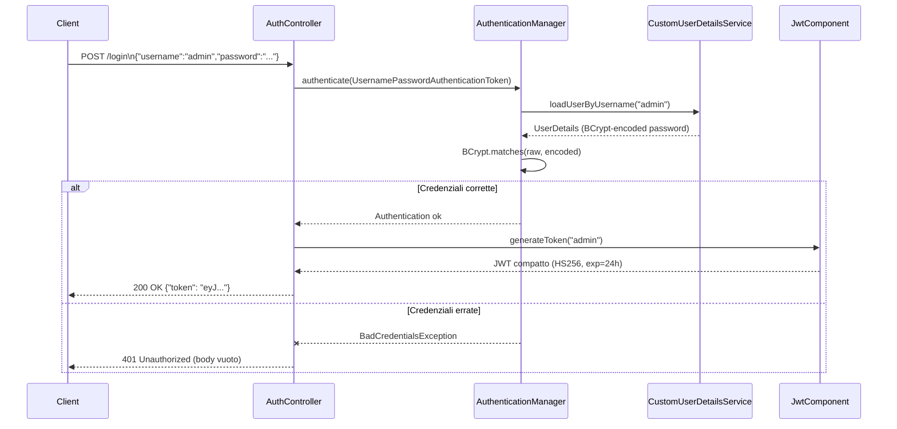

# Flusso: Autenticazione JWT

## Descrizione

Il controller usa autenticazione **JWT stateless** con un singolo account admin. Non esiste gestione multi-utente né sessione server-side.

## Endpoint

| Metodo | Path | Auth richiesta |
|---|---|---|
| `POST` | `/login` | No (path pubblico) |

Tutti gli altri endpoint richiedono il token JWT nell'header `Authorization: Bearer <token>`.

---

## Diagramma di Sequenza — Login

## Diagramma di Sequenza — Richiesta Autenticata

```mermaid
sequenceDiagram
    participant C as Client
    participant JF as JwtAuthFilter
    participant JWT as JwtComponent
    participant UDS as CustomUserDetailsService
    participant SC as SecurityContextHolder
    participant Ctrl as Controller

    C->>JF: Request + "Authorization: Bearer <token>"
    JF->>JWT: isValid(token)

    alt Token valido (firma + scadenza)
        JWT-->>JF: true
        JF->>JWT: extractUsername(token)
        JWT-->>JF: "admin"
        JF->>UDS: loadUserByUsername("admin")
        UDS-->>JF: UserDetails
        JF->>SC: Imposta autenticazione nel context
        JF->>Ctrl: filterChain.doFilter() → richiesta prosegue
        Ctrl-->>C: 200 / risposta
    else Token assente o non valido
        JWT-->>JF: false / eccezione
        JF->>Ctrl: filterChain.doFilter() senza autenticazione
        Ctrl-->>C: 401 / 403
    end
```

---

## Classi Coinvolte

| Classe | Ruolo |
|---|---|
| `AuthController` | Endpoint `/login`, costruisce `LoginRequest`/`LoginResponse` (record interni) |
| `JwtComponent` | Genera e valida JWT (JJWT, algoritmo HS256) |
| `CustomUserDetailsService` | Carica l'unico account admin (password BCrypt-encoded a startup) |
| `JwtAuthFilter` | `OncePerRequestFilter`; estrae il token dall'header e imposta il `SecurityContext` |
| `SecurityConfig` | Configura la security chain: STATELESS, no CSRF, percorsi pubblici, BCrypt encoder |

---

## Dettagli Implementativi

### JwtComponent
- La chiave HMAC-SHA256 viene derivata da `security.jwtSecret` (obbligatoria, min 32 byte UTF-8).
- Scadenza configurata con `security.jwtExpirationMs` (default 86400000 ms = 24h).
- `isValid(token)` restituisce `false` per qualsiasi `JwtException` (firma non valida, token scaduto, malformato).

### CustomUserDetailsService
- L'istanza `UserDetails` viene costruita **una volta al boot** con password BCrypt-encoded.
- Non esiste database: credenziali provengono esclusivamente da `MinecraftServerOptions.security`.
- L'avvio fallisce con `IllegalStateException` se username o password sono blank.

### JwtAuthFilter
- `shouldNotFilterAsyncDispatch()` restituisce `false`: il filtro viene eseguito anche per i dispatch asincroni, necessario perché SSE (log e info stream) usa async dispatch.
- Errori `UsernameNotFoundException` sono catchati e silenziati: la richiesta prosegue senza autenticazione → 401/403 dal security chain.

---

## Edge Case

| Scenario | Comportamento |
|---|---|
| Token scaduto | `jwtUtil.isValid()` → false → 401 |
| Token con firma non valida | `jwtUtil.isValid()` → false → 401 |
| Username non esistente nel token | `loadUserByUsername` → `UsernameNotFoundException` → silenz. → 401 |
| Password errata | `BadCredentialsException` → 401 (body vuoto dal controller) |
| Richiesta a `/swagger-ui/**` senza token | Sempre permessa (path pubblico) |
| `jwtSecret` < 32 char | `IllegalStateException` a startup: applicazione non parte |
