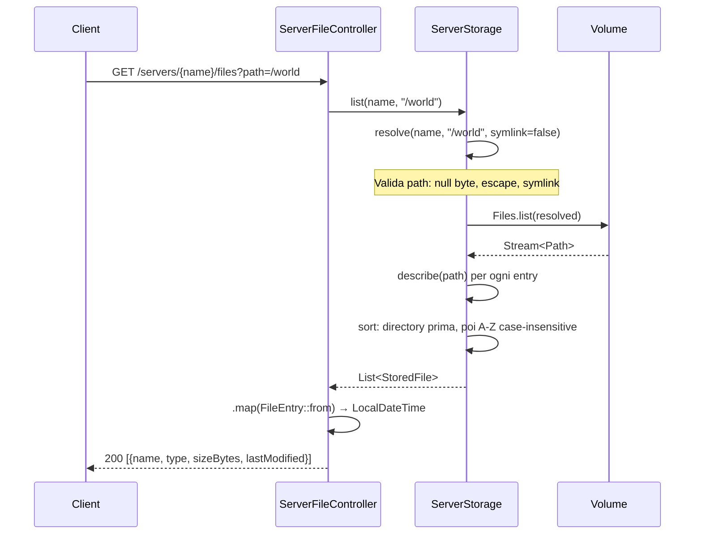
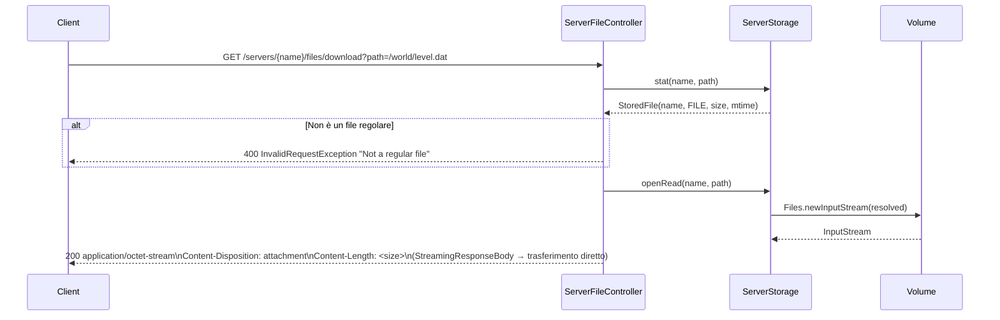
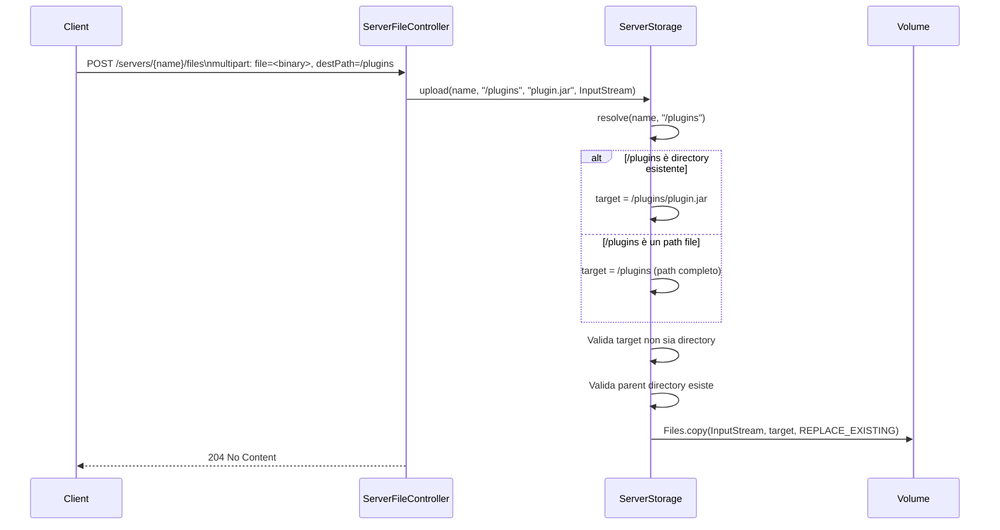
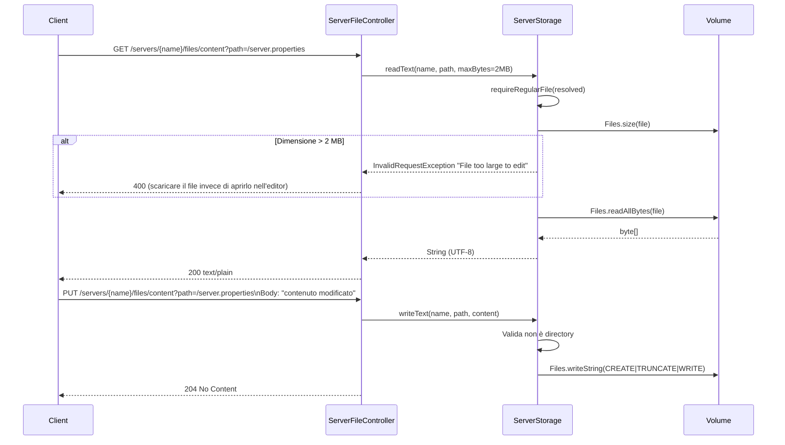
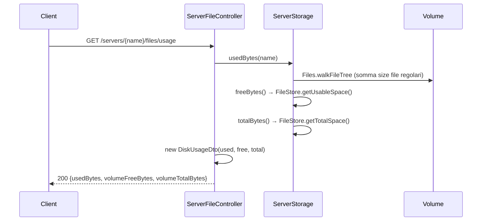

# Flusso: Gestione File

## Descrizione

API di file manager per la cartella dati di un server. Tutte le operazioni accedono direttamente al volume condiviso tramite `ServerStorage`, indipendentemente dallo stato del server (funziona anche con il server fermo).

La sicurezza è gestita da `ServerStorage.resolve()`: ogni path viene validato per evitare directory traversal (`..`) e symlink escape.

## Endpoint

| Metodo | Path | Query params | Descrizione |
|---|---|---|---|
| `GET` | `/servers/{name}/files` | `path=/` | Lista directory |
| `GET` | `/servers/{name}/files/download` | `path=<file>` | Download file (streaming) |
| `POST` | `/servers/{name}/files` | `destPath=<dir>`, `file=<multipart>` | Upload file (max 1 GB) |
| `POST` | `/servers/{name}/files/directory` | `path=<dir>` | Crea directory |
| `POST` | `/servers/{name}/files/touch` | `path=<file>` | Crea file vuoto / aggiorna mtime |
| `DELETE` | `/servers/{name}/files` | `path=<path>` | Elimina file o directory |
| `GET` | `/servers/{name}/files/content` | `path=<file>` | Leggi testo (max 2 MB) |
| `PUT` | `/servers/{name}/files/content` | `path=<file>` | Scrivi testo |
| `POST` | `/servers/{name}/files/rename` | `path=<path>`, `newName=<name>` | Rinomina |
| `POST` | `/servers/{name}/files/copy` | `sourcePath=<path>`, `destPath=<path>` | Copia |
| `GET` | `/servers/{name}/files/usage` | — | Spazio disco usato / disponibile |

---

## Layout Volume

```
<dataDir>/
└── <server-name>/          ← root del server (IRRIMUOVIBILE via API)
    ├── logs/
    │   └── latest.log      ← letto anche da ServerConsoleService
    ├── world/
    ├── server.properties
    └── ...
```

---

## Diagramma: Lista e Navigazione



---

## Diagramma: Download File



**Nota**: `StreamingResponseBody` evita buffering in memoria: adatto per file di qualsiasi dimensione.

---

## Diagramma: Upload File



**Limite**: `spring.servlet.multipart.max-file-size=1GB` (configurato in `application.properties`). File più grandi ricevono 413.

---

## Diagramma: Lettura / Scrittura Testo



---

## Regole di Sicurezza e Validazione

Tutte le operazioni passano per `ServerStorage.resolve(server, rel, leafMayBeLink)`:

1. **Null byte**: path con `\0` → `InvalidRequestException "Invalid path"`
2. **Backslash**: normalizzati in forward slash
3. **Escape lessicale**: `normalize()` dopo `resolve()` → se il risultato non parte dalla dir del server → `InvalidRequestException "Path escapes the server directory"`
4. **Symlink escape**: il sistema risolve `toRealPath()` sugli antenati esistenti del path e verifica che stiano dentro la dir del server → previene symlink che puntano fuori
5. **Root directory**: cancellazione e rinomina della root del server sono rifiutate
6. **Rename**: nessun path separator (`/` o `\`) nel nuovo nome
7. **Copy directory-in-itself**: rilevata e rifiutata

---

## Spazio Disco (`GET /files/usage`)



---

## Gestione Eccezioni

| Eccezione | HTTP | Causa |
|---|---|---|
| `ResourceNotFoundException` | 404 | Directory/file non trovato, parent non trovato |
| `InvalidRequestException` | 400 | Path non valido, non è file regolare, file troppo grande, nome con separator |
| `ConflictException` | 409 | Directory già esiste (mkdir), file già esiste (rename/copy) |
| `MaxUploadSizeExceededException` | 413 | File upload > 1 GB |
