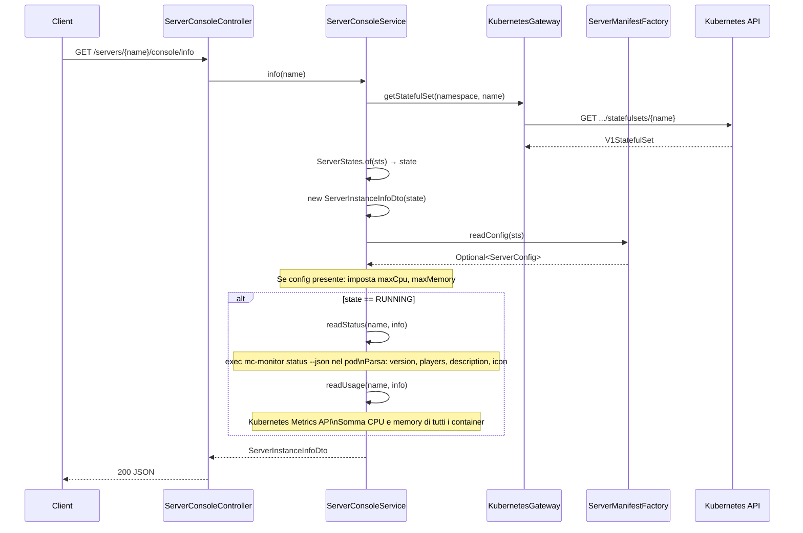
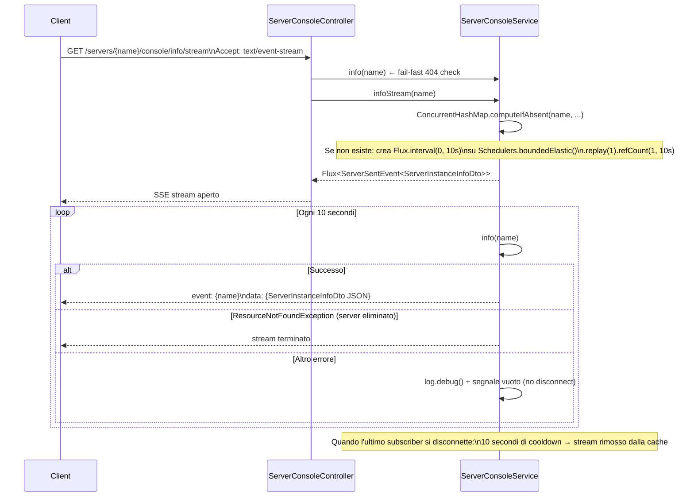
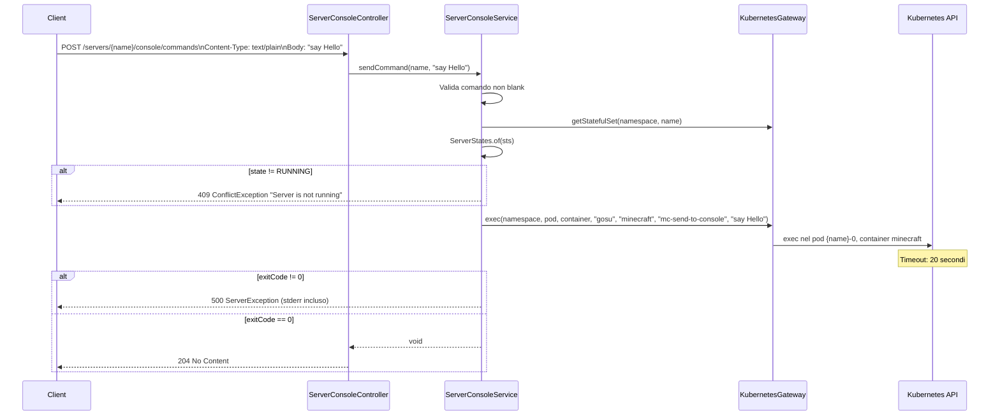
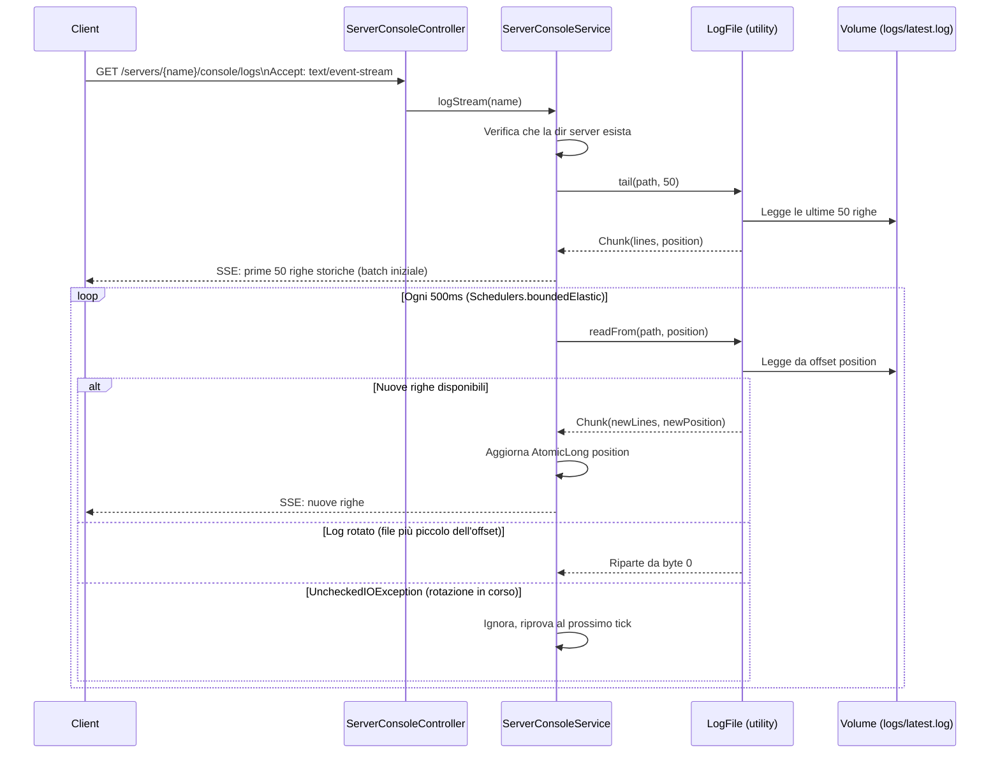

# Flusso: Console Server

## Descrizione

Accesso live a un server in esecuzione: informazioni runtime (CPU, memoria, giocatori), stream di log, invio comandi alla console Minecraft.

Due stream SSE (Server-Sent Events) per il monitoring in tempo reale:
- **Info stream**: stato + metriche ogni 10 secondi
- **Log stream**: tail live di `logs/latest.log` ogni 500ms

Entrambi leggono direttamente dal **volume condiviso** o tramite **exec nel pod**, quindi funzionano indipendentemente dallo stato del server (anche se fermo per i log storici).

## Endpoint

| Metodo | Path | Tipo risposta | Descrizione |
|---|---|---|---|
| `GET` | `/servers/{name}/console/info` | `application/json` | Snapshot info (one-shot) |
| `GET` | `/servers/{name}/console/info/stream` | `text/event-stream` | SSE info ogni 10s |
| `POST` | `/servers/{name}/console/commands` | — | Invia comando Minecraft |
| `GET` | `/servers/{name}/console/logs` | `text/event-stream` | SSE log live |
| `GET` | `/servers/{name}/console/logs/history` | `application/json` | Log storici (paginati) |

---

## Flusso: Info Snapshot (`GET /console/info`)

### Dettaglio `readStatus`

Esegue `mc-monitor status --host localhost --port 25565 --json` nel container `minecraft` del pod `{name}-0`.

Parsing del JSON di risposta (`server_info`):
- `version` → `ServerVersionDto` (name, protocol)
- `players.online`, `players.max`, `players.Samples[]` → `ServerPopulationDto`
- `description` → `ServerDescriptionDto` (struttura MOTD Minecraft)
- `favicon` → `String` base64

Fallimenti (pod non raggiungibile, exit code != 0, JSON malformato) sono loggati a DEBUG e ignorati: l'info DTO viene restituito con i campi live a null.

### Dettaglio `readUsage`

Usa `GenericKubernetesApi` per `metrics.k8s.io/v1beta1/pods/{name}-0`.

Se `metrics-server` non è installato o non ha ancora dati, restituisce `Optional.empty()` e i campi `cpuUsage`/`memoryUsage` restano null (best-effort).

Conversioni:
- CPU: somma `BigDecimal` cores → milli-CPU (`* 1000`, arrotondamento `HALF_UP`)
- Memory: somma byte → MB (`/ 1024*1024`)

---

## Flusso: Info Stream SSE (`GET /console/info/stream`)

**Condivisione stream**: il `Flux` è condiviso tra tutti i client che guardano lo stesso server (`.replay(1)` invia subito l'ultimo valore a nuovi subscriber). Questo evita N poll Kubernetes per N client simultanei.

---

## Flusso: Invio Comando (`POST /console/commands`)

---

## Flusso: Log Stream SSE (`GET /console/logs`)

### Dettagli `LogFile`

- `tail(path, n)`: legge a blocchi da 8KB dal fondo del file, raccoglie n righe complete
- `readFrom(path, pos)`: legge max 1 MB di nuovi dati da `pos`; restituisce solo righe complete (terminazione `\n`); strip `\r`
- Rotazione rilevata: se `file.size() < pos` riparte da 0
- Righe lunghe (> 1MB): emesse comunque per evitare stallo

### Log History (`GET /console/logs/history`)

Parametri: `limit` (default 100, max 5000), `skip` (default 0).

`LogFile.window(path, limit, skip)`: finestra di lettura che salta le ultime `skip` righe e restituisce le `limit` righe precedenti.

---

## Gestione Eccezioni

| Eccezione | HTTP | Contesto |
|---|---|---|
| `ResourceNotFoundException` | 404 | Server non trovato (StatefulSet o directory) |
| `ConflictException` | 409 | Comando inviato a server non RUNNING |
| `InvalidRequestException` | 400 | Comando vuoto o blank |
| `ServerException` | 500 | Exec fallito nel pod (mc-send-to-console) |
| Client disconnect (SSE) | — | `AsyncRequestNotUsableException` / IOException "Broken pipe": silenziosamente ignorato da `GlobalExceptionHandler` |
