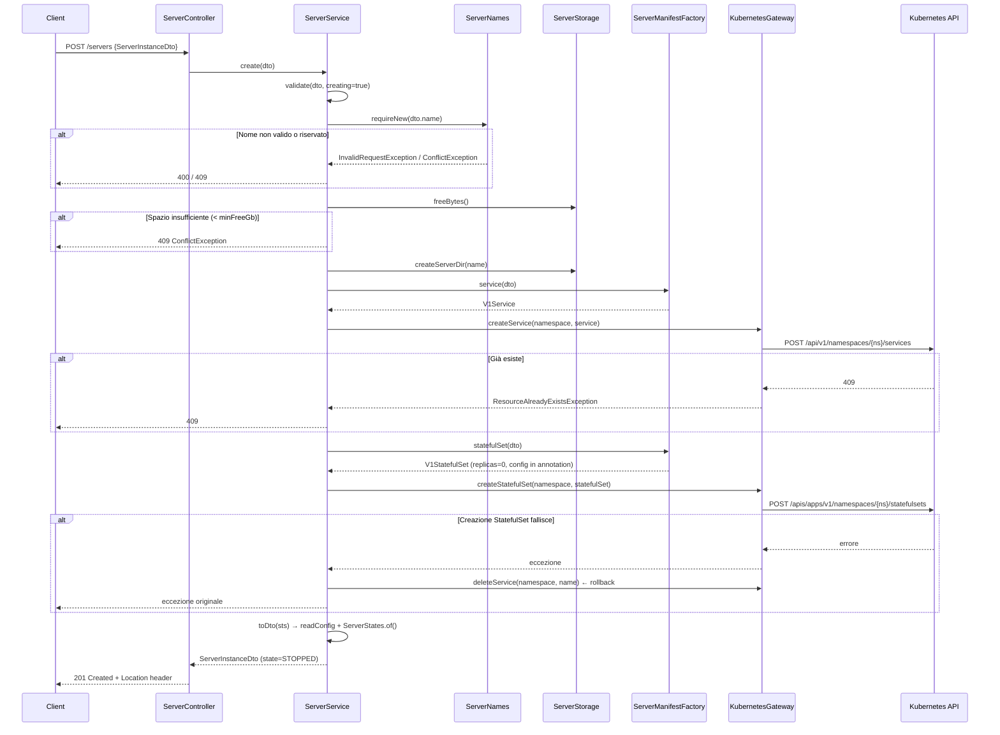
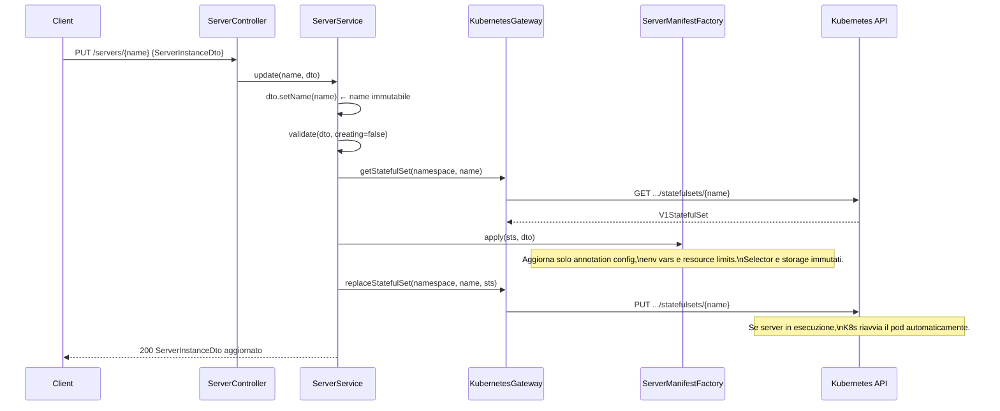
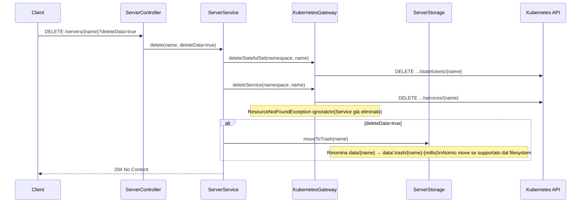

# Flusso: Ciclo di Vita dei Server

## Descrizione

Gestione completa di un server Minecraft: creazione, lettura, aggiornamento, eliminazione, avvio, stop e terminazione immediata. Ogni server corrisponde a una coppia di risorse Kubernetes (StatefulSet + Service).

## Endpoint

| Metodo | Path | Operazione |
|---|---|---|
| `GET` | `/servers` | Lista tutti i server |
| `GET` | `/servers/{name}` | Leggi un server |
| `POST` | `/servers` | Crea un server |
| `PUT` | `/servers/{name}` | Aggiorna un server |
| `DELETE` | `/servers/{name}?deleteData=true` | Elimina un server |
| `POST` | `/servers/{name}/console/start` | Avvia (replicas → 1) |
| `POST` | `/servers/{name}/console/stop` | Stop graceful (replicas → 0) |
| `POST` | `/servers/{name}/console/terminate` | Kill immediato |

---

## Flusso: Creazione Server



**Nota**: il server viene creato con `replicas=0` (fermo). Deve essere esplicitamente avviato.

---

## Flusso: Aggiornamento Server



---

## Flusso: Eliminazione Server



**Purga dati**: `TrashSweeper` controlla ogni ora i dati in `.trash` e rimuove permanentemente quelli con timestamp più vecchio di `trashRetentionHours` (default 24h).

---

## Flusso: Start / Stop / Terminate

```mermaid
sequenceDiagram
    participant C as Client
    participant CC as ServerConsoleController
    participant SS as ServerService
    participant KG as KubernetesGateway
    participant K8s as Kubernetes API

    C->>CC: POST /servers/{name}/console/start
    CC->>SS: start(name)
    SS->>KG: scaleStatefulSet(namespace, name, replicas=1)
    KG->>K8s: GET .../statefulsets/{name}/scale
    KG->>K8s: PUT .../statefulsets/{name}/scale (spec.replicas=1)
    CC-->>C: 204 No Content

    C->>CC: POST /servers/{name}/console/stop
    CC->>SS: stop(name)
    SS->>KG: scaleStatefulSet(namespace, name, replicas=0)
    Note over K8s: Il pod riceve SIGTERM; il terminationGracePeriod\n(default 120s) permette al server di salvare il mondo
    CC-->>C: 204 No Content

    C->>CC: POST /servers/{name}/console/terminate
    CC->>SS: terminate(name)
    SS->>SS: stop(name) → replicas=0
    SS->>KG: deletePodNow(namespace, podName)
    KG->>K8s: DELETE .../pods/{name}-0?gracePeriodSeconds=0
    Note over KG: ResourceNotFoundException ignorato\n(nessun pod in esecuzione)
    CC-->>C: 204 No Content
```

### Differenza Stop vs Terminate

| | Stop | Terminate |
|---|---|---|
| Meccanismo | `replicas=0` | `replicas=0` + delete pod immediato |
| Grace period | Rispettato (120s default) | Ignorato (`gracePeriodSeconds=0`) |
| Rischio dati | Minimo (salvataggio mondo) | Alto (dati non salvati) |
| Uso | Shutdown controllato | Server bloccato / non risponde |

---

## Lettura Stato e Lista

### `GET /servers/{name}` e `GET /servers`

Lo stato (`ServerState`) viene derivato **esclusivamente** dal StatefulSet tramite `ServerStates.of(sts)`:

```
spec.replicas=0, status.replicas=0  → STOPPED
spec.replicas=0, status.replicas>0  → SHUTDOWN (terminando)
spec.replicas≥1, readyReplicas=0    → STARTING
spec.replicas≥1, readyReplicas≥1    → RUNNING
```

La configurazione del server viene letta dall'annotation JSON `it.lorisdemicheli/config` dello StatefulSet (`ServerManifestFactory.readConfig()`). StatefulSet senza annotation valida (creati da versioni precedenti) vengono **ignorati** silenziosamente nella lista, con un `log.warn`.

---

## Gestione Eccezioni

| Eccezione | HTTP | Causa |
|---|---|---|
| `ResourceNotFoundException` | 404 | Server non trovato nel namespace K8s |
| `ResourceAlreadyExistsException` | 409 | Server già esistente (creazione duplicata) |
| `ConflictException` | 409 | Spazio insufficiente, CurseForge API key mancante, config annotation corrotta |
| `InvalidRequestException` | 400 | Validazione fallita (nome, CPU, memory, campi obbligatori) |
| `ServerException` | 500 | Errore imprevisto del Kubernetes API |
